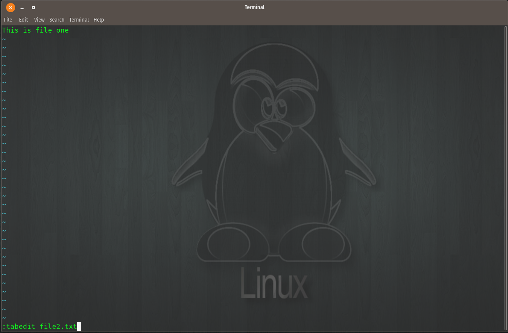
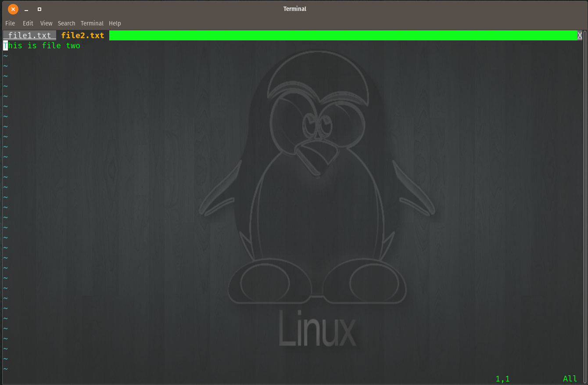
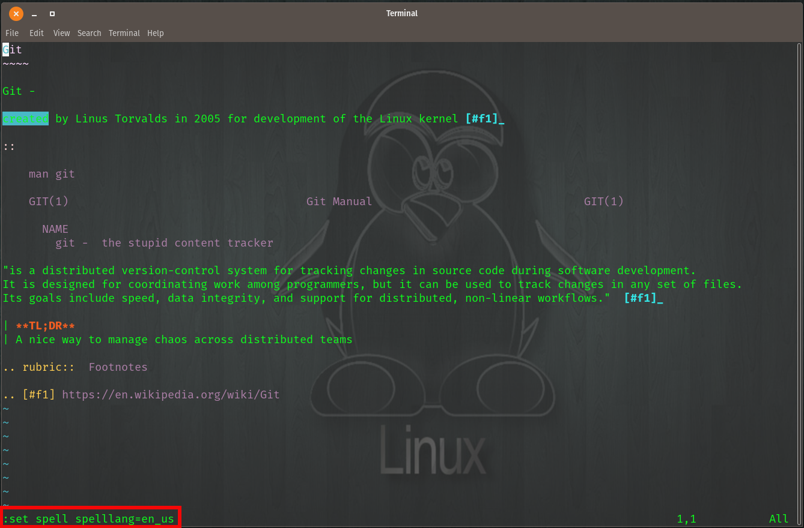

Linux
======

Some VIM features I used for this project

::

    Shift + ^            { beginning of line }
    Shift + G           { last line }
    Shift + $           { end of line }
    Shift + V           { block editor }
    y                   { yank }
    Shift + P           { paste }
    dd                  { delete/cut }

To edit files in VIM with tabs use the command  ``:tabedit <filename>``

.. centered:: Fig 1

Now both files will show

.. centered:: Fig 2

To navigate between tabs use the keys

* gt
* gT
* {n}gt where {n} is equal to the tab you want to go to  (i.e. 2gt will take you to second tab)

Use ``:tabonly`` to close all tabs but the currently selected one

Go back in time to earlier versions

::

    :earlier 2m

Examples:

.. image:: imgs/time1.png
   :scale: 60%
   :align: center
.. centered:: Fig 3

.. centered:: Fig 4

.. centered:: Fig 5

One other cool feature if you are using vim vs an IDE, setting up a ``.vimrc`` file to add line numbers

::

    vim .vimrc

    :set nu

Now, we have all this content (these modules built on RTD) and so many spelling errors everywhere....

.. sidebar:: Aspell Installation

   | brew install aspell
   | (yum/apt) install aspell

We have some options in either VIM (slow process) or with ``aspell``

How I did it:: 

    for f in *.rst
    do
        aspell check $f
    done

Or as a one-liner::

    for f in *.rst;do aspell check $f;done

Within VIM we add the directive ``:set spell spelllang=en_us`` and it will highlight words

.. centered:: Fig 6
